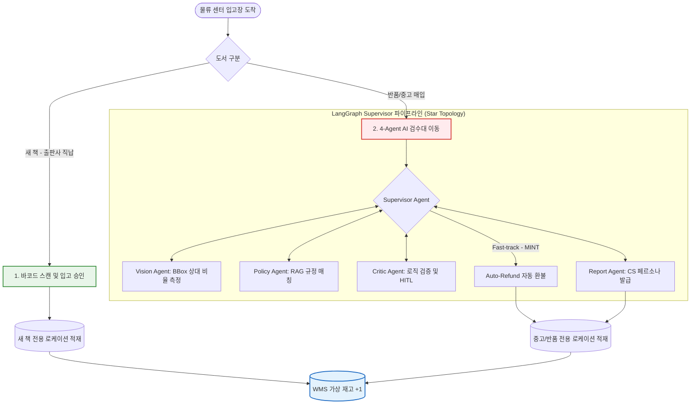
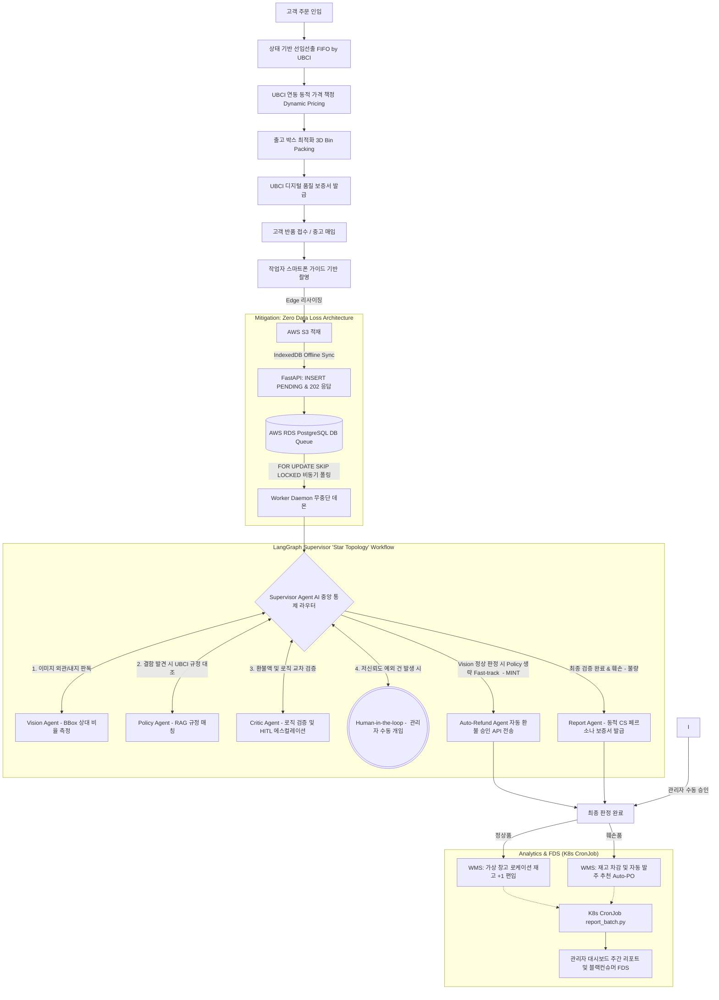
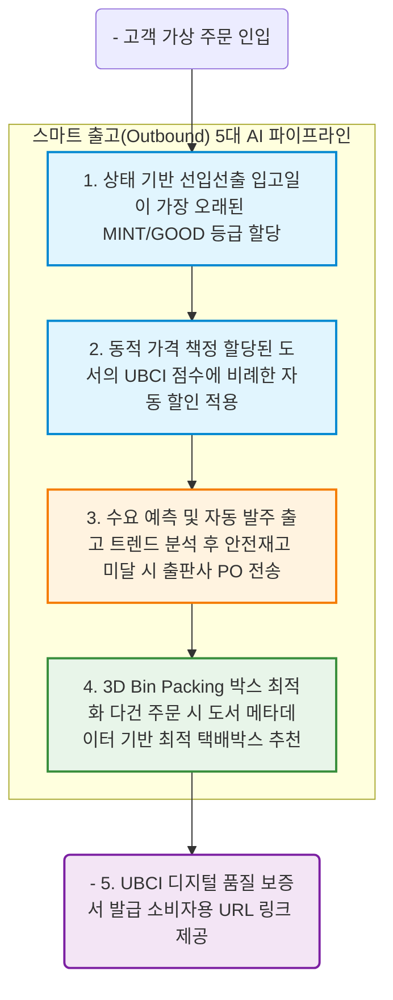

# [연구개발계획서] 멀티 에이전트 기반 B2B 도서 물류(입출고·반품) 자동화 및 AI 재고 관리(WMS) 플랫폼

## 제1장. 서론

- **1.1 연구개발의 목적:** 본 연구는 이커머스 및 3PL 풀필먼트 센터에서 겪는 **입출고 누락, 재고 불일치, 반품 검수 병목**이라는 물류 3대 난제를 해결하기 위해, 단순 시각 검수를 넘어선 'AI 멀티 에이전트 기반 도서 물류(입출고·반품) 자동화 및 AI 재고 관리(WMS) 플랫폼'을 개발하는 것을 목적으로 한다.
- **1.2 연구개발의 정의 및 핵심 범위:** 작업자의 스마트폰을 활용한 반품 도서 캡처부터 Supervisor 기반 다중 에이전트 교차 검증은 물론, **[고객 주문 인입 ➡️ 출고 ➡️ 반품 ➡️ AI 검수 ➡️ 재고 편입(입고) 및 자동 발주]**로 이어지는 물류의 전체 생애주기(Lifecycle)를 자동화하고 관리자용 AI 인사이트를 제공하는 End-to-End 솔루션이다.

## 제2장. 선정 배경 및 필요성

- **2.1 물류(WMS) 동맥경화와 비용 누수:** 이커머스 시장의 폭발적 성장 이면에는 반품률의 증가와 입출고 트랜잭션의 과부하가 존재한다. 판매자가 반품 상품을 빠르게 검수할 역량이 부족한 경우, 재판매 가능한 상품도 폐기되어 심각한 비용 누수가 발생한다([물류신문](https://www.klnews.co.kr/news/articleView.html?idxno=313225) 참조).
- **2.2 소비자 신뢰 확보의 한계:** 반품 상품을 제대로 된 체계 없이 '최상급'으로 재판매했다가 파손/오배송으로 인해 소비자 불신이 커진 사례가 다수 보도된 바 있다([국민일보](https://www.kmib.co.kr/article/view.asp?arcid=1766306836) 참조). 이는 검수 과정에서 상태와 등급을 일관되게 관리(UBCI)하고 결과를 구조화하여 제공(Digital Certificate)해야 함을 강력히 시사한다.
- **2.3 기술적 돌파구 (VLM과 Multi-Agent의 결합):** 비전 AI의 발전으로 인간의 검수 시간을 대폭 단축할 수 있게 되었으며([동아일보](https://www.donga.com/news/Economy/article/all/20250420/131453622/2)), 최근 학계에서는 "소수의 정상/불량 예시와 텍스트 설명"을 결합해 VLM의 시각 검수 역량을 끌어올리는 연구가 주목받고 있다([arXiv:2502.09057](https://arxiv.org/abs/2502.09057)). 우리의 **Vision + Policy Agent (RAG)** 결합 파이프라인은 이러한 최신 기술 트렌드를 비즈니스에 완벽하게 상용화한 모델이다.
- **2.4 Human-in-the-Loop 타당성:** AI가 100% 완벽하지 않더라도 모호한 건만 관리자가 재확인(Human Review Queue)하는 체계만으로도 막대한 비즈니스 가치를 창출함이 여러 산업(의류 검수 등)에서 증명되었다.

## 제3장. 적용 기술 및 시스템 아키텍처

본 시스템은 7주라는 개발 제약을 극복하기 위해, 비동기 파이프라인과 LangGraph 기반의 유연한 에이전트 상태(State) 관리 및 MemorySaver(Snapshot)를 활용한 HITL 아키텍처로 설계되었다.

### 3.1 핵심 아키텍처 레이어

- **Client Layer (Vercel):** Next.js 16 (App Router) 기반 웹앱. 
  - **작업자용 UX 극대화:** 스마트폰 거치대와 블루투스 풋페달을 연동하여 '핸즈프리 검수 환경' 구축.
  - **PWA Offline-First Queue:** 네트워크 음영 구역에서도 IndexedDB를 활용해 촬영본을 캐싱하고 와이파이 복구 시 백그라운드 동기화(Service Worker).
  - 관리자용 **실시간 가상 재고(로케이션) 현황판, AI 주간 인사이트 리포트 대시보드** 지원.
- **WMS Core API Layer (FastAPI):** Python FastAPI 기반 메인 비즈니스 서버. 주문, 출고, 입고, 반품, 재고 증감을 모두 포괄하는 **WMS 코어 트랜잭션 전담**. 
- **Orchestration & AI Worker Layer (API & Worker 분리):** 
  - **API Pod:** 클라이언트 요청 시 DB에 `PENDING` 큐만 적재하고 즉시 응답(`202 Accepted`)하여 병목을 원천 차단.
  - **AI Worker 데몬:** Celery/Redis를 배제하고 LangGraph 기반 Supervisor (Star Topology) 상태 머신 구동. K8s 오토스케일링(HPA) 환경에서의 메모리 증발 및 중복 실행을 막기 위해 DB 큐를 PostgreSQL `FOR UPDATE SKIP LOCKED`로 폴링.
- **Analytics & FDS Layer (CronJob 분리):**
  - 무거운 Pandas/ML 기반 이상거래탐지(FDS) 및 주간 리포팅 로직은 API 서버 부하 방지를 위해 **K8s CronJob + 독립 Batch 스크립트** 형태로 분리하여 매일 자정 실행.
- **Data & Storage Layer (Two-Track 전략):**
  - **[Plan A] 메인:** AWS RDS (PostgreSQL) + AWS S3 (에이전트 로그 저장을 위한 JSONB 컬럼 활용)
  - **[Plan B] 롤백:** Supabase (PostgreSQL + Storage) (초기 인프라 세팅 병목 시 즉각 전환)
- **AI & LLMOps Layer (OpenAI, LangSmith):**
  - **LangSmith & MemorySaver:** Multi-Agent 트레이싱(Tracing)과 HITL 발생 시 상태 일시정지/재개(Snapshot) 지원. Critic Agent는 명시적인 에러 분류를 위해 **Reason Codes**를 활용.
  - 시각 판독(Vision Agent)은 정확도가 높은 `GPT-4o`를 채택.
  - 규정 판독, 검증, 리포트 생성 등 텍스트 기반 에이전트는 가성비가 높은 `GPT-4o-mini`를 사용하여 전체 API 통신 비용 최적화.

### 3.1.2 대용량 이미지 처리 및 저장 파이프라인 (S3 Pre-signed URL)
대규모 물류센터의 병목 현상을 방지하기 위해 백엔드 서버를 거치지 않고 S3와 다이렉트로 통신하며, 무거운 이미지와 가벼운 LLM 연산 데이터를 철저히 분리(Decoupling)합니다.

1. **S3 Direct Upload (병목 방지):** 클라이언트(모바일/웹)가 백엔드 API에서 S3 Pre-signed URL만 발급받아, 5~10MB의 대용량 고화질 사진을 S3 버킷에 직접 업로드합니다. 백엔드 서버는 무거운 이미지 트래픽을 처리하지 않아 서버 부하가 0(Zero)입니다.
2. **경량 JSON 패싱 (토큰/레이턴시 최적화):** Vision Agent는 S3 URL을 통해 원본 이미지를 판독하고, 결함의 **BBox 좌표와 상대 비율(Ratio) 데이터(JSON 형식)**만을 추출합니다. 이후 이어지는 Policy, Critic, Report Agent들은 무거운 이미지 없이 이 가벼운 텍스트(JSON) 데이터만으로 RAG 매칭 및 검증 연산을 수행하여 LLM 호출 비용과 시간을 극단적으로 절약합니다.
3. **OpenCV 시각화 및 DB 최적화:** AI 추론이 끝나면 백엔드 파이썬 워커가 OpenCV를 활용하여 BBox 좌표를 기반으로 원본 이미지 위에 빨간색 결함 박스(YOLO 매핑 형태)를 그립니다. 이 시각화된 **'결과 이미지'를 다시 S3에 업로드**하고, RDB(PostgreSQL)에는 이미지 바이너리(BLOB) 대신 **S3 URL 텍스트 1줄만 적재**하여 DB 성능 팽창(Anti-pattern)을 완벽히 방지합니다.

### 3.2 WMS 통합 입고(Inbound) 라우팅 흐름도

물류센터에 도서가 도착했을 때, 새 책과 중고/반품 서적을 구분하여 라우팅(Routing)하는 WMS의 첫 관문 다이어그램입니다. 새 책은 즉시 재고로 편입되며, 중고/반품 서적만이 AI 검수 파이프라인으로 이동합니다.

### 3.3 반품/중고 서적 전용 4-Agent AI 검수 워크플로우

## 3.4 중고 도서 상태(UBCI) 기반 등급 판정 시스템

신간 도서 반품 외에 **중고 도서 매입 플랫폼** 타겟을 커버하기 위해, 작업자가 속지의 낙서/찢김 등을 다중 촬영하여 전송하면 AI가 훼손 정도를 점수화하는 **UBCI(Used Book Condition Index)** 알고리즘을 탑재한다.

- **UBCI 산출 공식 (Policy Agent 방식):** 세부 감점 가중치 및 페널티 수식은 내부 정책(Vector DB RAG 매칭)에 따라 동적 산출 (대외비)
  (발견된 훼손의 상대 비율 및 심각도를 고려하여 최적의 감점 폭을 추론)
- **AI 기반 훼손 영역 탐지:** AI가 이미지에서 훼손 부위를 자동으로 탐지하여 정량적 크기를 측정.
- **다중 등급 WMS 재고 DB (Composite Key 분리):**
  - **MINT/EXCELLENT/GOOD:** 정상 재고 및 감가 매입 재고로 WMS 로케이션 편입.
  - **FAIR/SCRAP:** 악성 재고 방지를 위해 매입 불가(반송 및 폐기) 처리.
  - 기존 단일 수량 재고 테이블을 `[도서 바코드 + 상태 등급]` 복합 키 구조로 개편하여 재고 관리의 깊이를 더함.

## 3.5 스마트 출고(Outbound) 시스템 고도화

WMS의 완전한 사이클(Closed-loop) 완성을 위해, 입고된 도서가 판매되어 출고될 때 AI 및 데이터를 활용한 5대 고도화 파이프라인을 가동한다.
1. **UBCI 점수 연동 동적 가격 책정 (Dynamic Pricing):** 동일 등급이라도 UBCI 점수에 따라 할인율을 차등 적용하여 악성 재고 회전율을 극대화한다.
2. **수요 예측 기반 자동 발주 (Demand Forecasting):** 일일 출고 데이터를 시계열로 분석(Moving Average 등)하여, 안전 재고에 도달하기 전 선제적으로 출판사에 발주서(PO)를 전송한다.
3. **상태 기반 선입선출 (FIFO by UBCI):** 작업자의 출고 지시서(Picking List) 생성 시, 동일 등급 중 입고일이 가장 오래된 도서의 로케이션을 우선 배정하여 노후화를 방지한다.
4. **출고 박스 최적화 (3D Bin Packing):** 다건 주문 시, 도서들의 부피(가로/세로/두께)를 합산하여 가장 물류비가 적게 드는 최적의 택배 박스 사이즈를 작업자에게 자동 추천한다. *(※ 외부 API에서 도서 규격 데이터 누락 시, 카테고리(신국판/B5 등)와 페이지 수를 기반으로 부피/무게를 자동 추정하는 자체 Fallback 알고리즘 탑재)*
5. **UBCI AI 품질 보증서 자동 발급:** 출고 시점, Report Agent가 생성했던 검수 데이터를 기반으로 모바일에서 즉시 확인 가능한 **디지털 품질 보증서(URL 링크)**를 알림톡으로 발송하여 중고 거래의 정보 비대칭성을 해소한다.

## 제4장. 실현 가능성 및 개발 계획 (총 7주 압축 플랜)

개발 기간 단축(7주)과 백엔드 부하 상승에 대응하기 위해 조기 코드 프리즈(Code Freeze) 및 프론트엔드/데이터 팀원의 병렬 QA 체제를 가동한다.

- **4.1 역량 맞춤형 분업 전략 (7인 체제 - 실명 R&R 기반):**
  - **Tech PM (장문경):** Git Gatekeeper (main 브랜치 단독 머지 권한), DevOps/EKS 인프라 매니저, 전체 스프린트 Kanban 마스터.
  - **WMS Core API (박민우):** 주문, 출고, 입고, 반품, 재고 증감을 모두 포괄하는 WMS 코어 API 1인 전담 (DB 트랜잭션 충돌 방지).
  - **Backend Orchestration (서다은):** LangGraph 에이전트와 WMS API 연동, 관리자 대시보드 통계/리포트용 데이터 제공 API 구현.
  - **AI Lead (박준희):** LangGraph 다중 에이전트 파이프라인(Vision, Policy, Critic, Report) 조립 및 최적화, 대시보드용 AI 트렌드 리포트 프롬프트 튜닝.
  - **Policy Data Research (소한민, 홍경표):** 타사 물류 플랫폼(교보문고, 아마존 등)의 약관 및 가이드라인을 리서치하고 RAG 청크(YAML) 형태로 수집.
  - **Data/MLOps (소한민):** 원시 이미지 데이터 정제, 오토 라벨링 파이프라인 구축, 소형 모델 지식 증류 리서치.
  - **QA/CI-CD (박민우):** 백엔드 단위/통합 테스트, GitHub Actions 기반 린팅(Linting) 및 자동 배포 파이프라인 구축.
  - **Frontend UI/UX & Policy Data Integration (고영빈 - FE & Data 통합 메인 리드):** FE-1(모바일 카메라/Canvas 리사이징 전담) 개발 및 UI/UX 총괄, 타사 정책 데이터 RAG 청크 통합 및 지식베이스 마스터 관리.

- **4.2 6+1주 연구개발 마일스톤:**
  - **[1주차 / PoC 및 기획]:** 더미 API 배포, 도서 훼손 이미지 데이터 구축, LangGraph 기본 노드 구조 설계.
  - **[2~3주차 / 코어 연동]:** FastAPI 통합 라우팅 및 LangGraph 4-Agent 체인 연동 완성, 모바일 뷰 이미지 업로드 및 SSE 적용.
  - **[4~5주차 / 대시보드 및 예외 처리]:** 관리자 대시보드(수동 승인 및 에이전트 로그 조회) 구현, 클라이언트 폴링 및 재시도(Retry) 로직 적용.
  - **[6주차 / Code Freeze]:** K8s 배포 및 모든 유닛 개발 완료, 100% Code Freeze 실시.
  - **[7주차 / QA 및 리허설]:** 신규 기능 추가 금지, 통합 E2E QA, 버그 픽스 및 데모 시연 시나리오 리허설 반복.

## 제5장. 정량적 및 정성적 평가 체계

| 평가 항목                         | 단위 | 기존 (수작업) | **목표치 (SaaS 도입 후)** | 측정 방법 및 기준                                         |
| :-------------------------------- | :--: | :-----------: | :-----------------------: | :-------------------------------------------------------- |
| **도서 결함 탐지 및 판정 정확도** |  %   |       -       |       **98% 이상**        | Critic Agent 교차 검증을 통한 최종 판정 Precision/Recall  |
| **건당 평균 검수 시간**           |  초  |   약 120초    |       **30초 이내**       | API 요청부터 4-Agent 체인 통과 후 DB 최종 업데이트 로깅   |
| **클라우드 건당 추론 비용**       |  원  |       -       |       **30원 미만**       | Vision(4o) + Text(4o-mini x 3) 복합 토큰 사용량 기반 산출 |

## 제6장. 기대효과 및 고도화 전략

- **기대효과:** 도서 반품 자동화로 물류센터 인건비를 혁신적으로 절감하며, Multi-Agent 시스템의 논리적이고 객관적인 거절 사유서 제공을 통해 악성 반품(블랙컨슈머) 분쟁을 원천 차단한다. 특히 FDS 기반의 어뷰징 탐지 및 LangSmith 기반 LLMOps 운영으로 엔터프라이즈 리스크를 방어한다.
- **고도화 로드맵:**
  - Phase 1 (현재): GPT-4o 기반 검수 파이프라인 구축 및 LLMOps(LangSmith/MemorySaver) 연동. Fast-track (Auto-refund) 라우팅을 통한 검수 대기시간 최소화.
  - Phase 2 (미래 확장): 축적된 도서 결함 정답 데이터를 바탕으로 **비용 0원의 경량 YOLO(눈)**를 증류(Distillation) 학습시키고, **저비용 텍스트 LLM(뇌)**과 결합하는 **하이브리드 아키텍처**로 전환하여 건당 추론 비용 극저하 달성.
